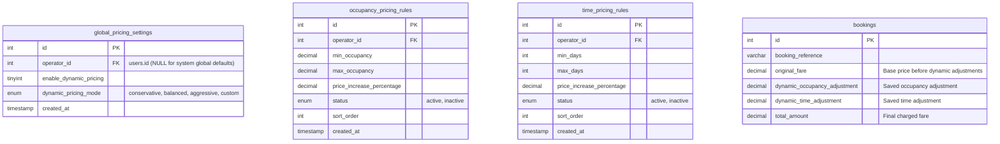
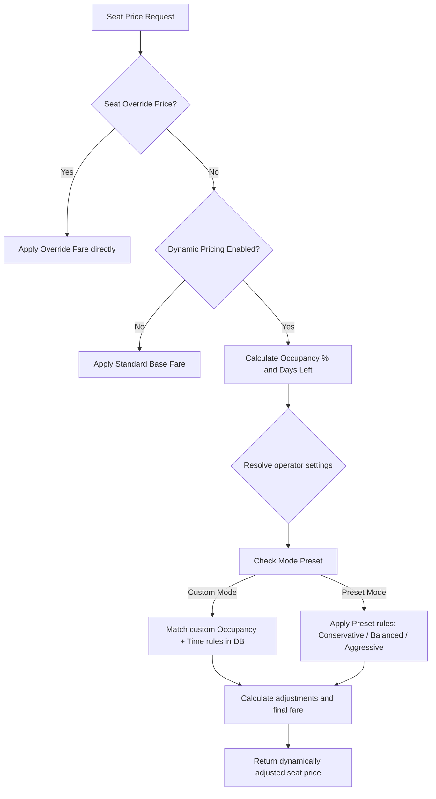

# Dynamic Pricing System: Architecture & Feature Documentation

This document covers the complete system architecture, database schema design, pricing calculation flow, front-end modules, and transactional audit trails for the dynamic pricing engine.

---

## 1. System Overview & Objectives
The dynamic pricing engine automatically calibrates ticket prices based on real-time factors:
1. **Bus Occupancy (%):** As more seats are booked, ticket prices scale upwards to maximize revenue on high-demand routes.
2. **Time to Departure (Days/Hours):** Last-minute bookings incur dynamic premiums, while early bookings enjoy baseline rates.

### Core Objectives:
- **Zero Hardcoded Percentages:** All pricing behaviors and rates are fully database-driven.
- **Operator Isolation:** Each operator configures their own rates without affecting others.
- **Immutable Historical Records:** Once a booking is finalized, dynamic adjustments are locked in and are immune to subsequent rule changes.

---

## 2. Database Schema Design

The engine is powered by four primary database tables:



---

## 3. Pricing Resolution Flow

When a seat price is queried, the engine processes calculations through the following hierarchy:



### Detailed Resolution Steps:
1. **Seat Overrides check:** If a custom price is set in `seat_price_overrides` or `seat_pricing` tables for the specific seat, that custom price is applied. Dynamic pricing rules are bypassed.
2. **Status check:** The system checks if dynamic pricing is enabled in `global_pricing_settings` for the trip operator. If disabled, the trip base fare is applied.
3. **Calculation:**
   - **Occupancy %** = $\frac{\text{Booked Seats}}{\text{Total Bus Seats}} \times 100$
   - **Days Left** = Days remaining between current time and trip departure date.
4. **Matching Engine:**
   - **Custom Mode:** Matches rules from `occupancy_pricing_rules` and `time_pricing_rules` matching the specific `operator_id` (falling back to global defaults where `operator_id` is null). Rules are sorted by `sort_order`.
   - **Preset Modes:**
     - **Conservative:** Maximum +15% occupancy increase, +10% time increase.
     - **Balanced:** Maximum +50% occupancy increase, +30% time increase.
     - **Aggressive:** Maximum +75% occupancy increase, +50% time increase.
5. **Adjustments Formula:**
   $$\text{Final Fare} = \text{Base Fare} + \left( \text{Base Fare} \times \frac{\text{Occupancy Increase \%}}{100} \right) + \left( \text{Base Fare} \times \frac{\text{Time Increase \%}}{100} \right)$$

---

## 4. Key Features

### I. Multi-Operator Isolation
- Global default rules (`operator_id IS NULL`) are seeded automatically during installation.
- Individual Admins can configure their own settings page.
- The lookup engine performs a localized query matching the trip's operating admin:
  ```sql
  SELECT * FROM global_pricing_settings WHERE operator_id = ? OR operator_id IS NULL ORDER BY operator_id DESC LIMIT 1
  ```
  *(Selecting the row with `operator_id DESC` guarantees that if a custom operator configuration exists, it will take priority over the `NULL` system fallback).*

### II. Integrated Sandbox Simulator
- Admins can preview dynamic pricing outcomes instantly without modifying live trips.
- Input parameters: **Base Fare**, **Total Active Seats**, **Seats Booked**, and **Days Left**.
- Computes real-time occupancy %, applies active operator mode rules, and displays the exact itemized breakdown of occupancy adjustment, time adjustment, and final ticket price.

### III. Customer Experience Visual Badges
On [book.php](file:///c:/wamp64/www/Bus/book.php), customers see:
- **Dynamic Pricing Active Badge:** Indicators highlighting when rules adjust pricing.
- **High Demand Route Badge:** Triggers automatically if occupancy goes above 70%.
- **Limited Seats remaining:** Warns when $\le 5$ seats are left.
- **Dynamic Seats Layout:** Indicated fares on each seat in the layout grid are updated in real-time.

### IV. Transaction Audit Trail (Checkout Safety)
- Server-side validation in [checkout.php](file:///c:/wamp64/www/Bus/checkout.php) verifies that seat prices match calculated rates before locking the transaction.
- Writes permanent fields to the database bookings row:
  - `original_fare`
  - `dynamic_occupancy_adjustment`
  - `dynamic_time_adjustment`
  - `final_fare`
- This ensures historical booking invoices are frozen and unaffected by future admin adjustments.
