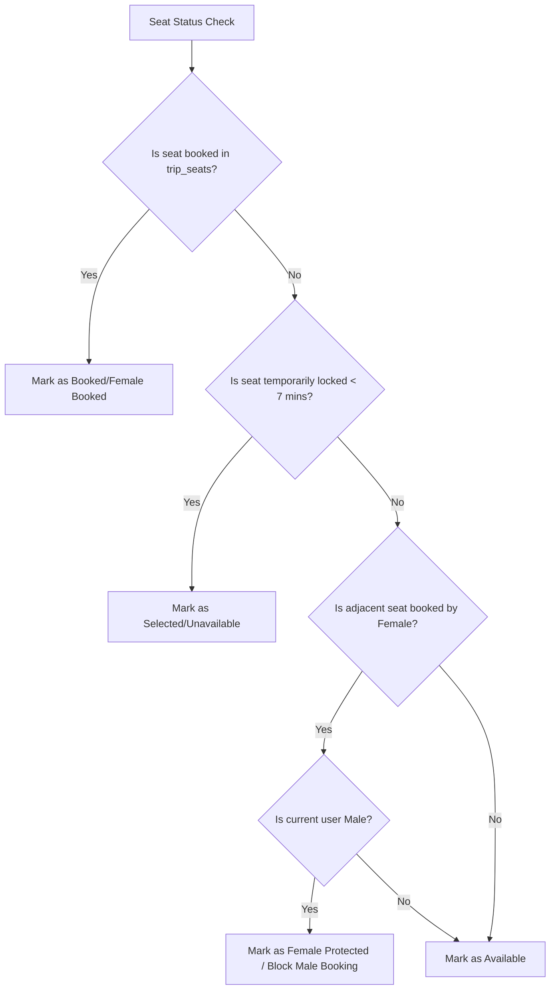

  # Master Project Documentation: Bus Booking System

This document provides a comprehensive technical overview of the entire Bus Booking system codebase, its architecture, security features, business logic rules, checkout flows, and operational modules.

---

## 1. System Architecture & File Structure

The project is built on standard PHP (OOP/Procedural) utilizing PDO for database transactions, with Tailwind CSS and Bootstrap on the front-end. The visual design system uses a sleek Slate/Charcoal dark-mode theme.

### Key File Mapping:
- **Root Directory:**
  - `index.php`: Landing page with trip search forms and route queries.
  - `search.php`: Lists active search results with trip filters (AC, Sleeper, Seater, etc.).
  - `book.php`: Interactive visual seat layout grid mapping lower/upper sleeper berths and seater layouts with live status feedback.
  - `checkout.php`: Process passenger info, apply discounts, runs checkout verification, and commits bookings.
  - `ticket.php` & `ticket_pdf.php`: Dynamic invoice ticket page with client-copy and agent-copy views.
  - `login.php`, `register.php`, `logout.php`: User authentication system.
- **`config/` & `includes/`:**
  - `config/security.php`: Core security middlewares, dynamic pricing algorithms, and layout helper checks.
  - `includes/db.php`: Centralized PDO database connection driver.
  - `includes/auth_middleware.php`: Middleware verifying active sessions, roles, and CSRF states.
  - `includes/header.php` & `includes/footer.php`: Global layouts and theme styling.
- **`admin/`:**
  - Administrative control panel dashboard.
  - `admin/pricing.php`: Admin pricing management console, simulator sandbox, and preset settings.
- **`ajax/`:**
  - Real-time endpoints for locking/releasing seats, applying promos, and loading notifications asynchronously.

---

## 2. Authentication & Hardened Security

The application is hardened against security risks:

### I. Session Security
- **`session_regenerate_id(true)`:** Implemented upon successful login to prevent session fixation attacks.
- **Cookie Security:** Sessions are configured with `Secure`, `HttpOnly`, and `SameSite` flags.
- **Session Timeout:** Automated cleanup terminates inactive sessions after 15 minutes of idle time.

### II. Login Throttling & Lockout
- Logs failed authentication attempts in the database.
- **Throttling rules:** Lock accounts temporarily for 15 minutes if they exceed 5 failed login attempts to prevent brute-force attacks.

### III. Request Integrity
- **CSRF Tokens:** All state-modifying requests (like booking, setting rules) validate unique tokens generated using cryptographically secure values.
- **Input Filtering:** Strict backend filters block XSS injections and SQL manipulations.

---

## 3. Advanced Booking & Seating Logic

The seat mapping system manages layout displays and rules dynamically.

### Key Business Rules:

#### I. Female Seat Protection
To ensure female passenger safety:
- If a seat is booked by a female passenger, the adjacent seat in the row (column pairs `0-1` and `3-4`) gets marked as **Female Protected**.
- Men are blocked from booking these protected adjacent seats.
- Exception: A male and a female passenger can book adjacent seats together within the **same single transaction** (group booking).

#### II. Temporary Seat Lock Timeout (Concurrency Guard)
- When a user clicks an available seat, an AJAX call locks the seat in `trip_seats` for **7 minutes** under their `locked_by_session`.
- If the user closes the window or fails to check out within 7 minutes, background timers release the locks automatically, making seats available for other users.
- This prevents dual-booking conflicts.

---

## 4. Dynamic Pricing Engine

Resolved prices follow a strict priority sequence:
$$\text{Seat Price Override} \rightarrow \text{Dynamic Pricing Rules} \rightarrow \text{Base Fare}$$

### Dynamic Adjustments:
1. **Occupancy-Based:** Ticket fares scale higher as the bus occupancy percentage increases.
2. **Time-Based:** Pricing scales higher as the departure date approaches.

### Mode Configurations:
- **Conservative Mode:** Small, controlled increases (Up to +15% occupancy, +10% time).
- **Balanced Mode:** Standard increases (Up to +50% occupancy, +30% time).
- **Aggressive Mode:** High-demand increases (Up to +75% occupancy, +50% time).
- **Custom Mode:** Runs calculations entirely against admin-defined parameters in the database.

---

## 5. Multi-Operator Isolation

- **Independent Pricing Settings:** Operator A's dynamic pricing settings and rules are separate from Operator B's.
- **Fallback Hierarchy:** If an operator has not set custom rules, the pricing engine falls back to global system default rules (`operator_id IS NULL`).
- **Administrative Isolation:** Operators can only manage layout styles, pricing overrides, and rules for their own buses and scheduled voyages.

---

## 6. Promotions & Checkout Transaction Pipeline

### I. Discount Calculations
- **Promo Codes:** Validated dynamically (e.g. `SAVE10` for 10% off, `FLAT100` for ₹100 off).
- **Agent Partners:** Agents get specialized discounts mapped directly from configured trip rates (percentage/fixed) and earn commissions.

### II. Checkout Transactions
- Executed inside a strict database transaction block (`$pdo->beginTransaction()`).
- All DDL statements are kept separate to prevent MySQL from triggering implicit commits.
- Validates seat availability and female passenger protection check once more right before inserting.
- Inserts booking records and updates seat statuses atomically. If any verification fails, the database rolls back changes to prevent data corruption.

---

## 7. Ticketing & Invoice Printing

### Copy Isolation (Original vs. Discount Price)
When agents buy tickets for their clients, they receive discounts. However, the end customers must see the original price:
- **Agent Copy:** Renders the discounted price showing net totals, commission margins, and applied partner discounts.
- **Customer Copy:** Renders the original fare (recalculated from base + adjustments). Both online views and PDF downloads (`ticket_pdf.php`) isolate these views cleanly.
